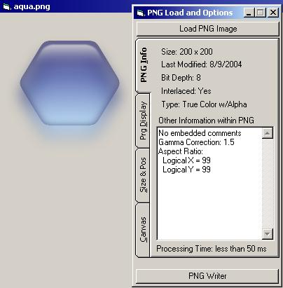



## PNG Reader : Updated  \(by LaVolpe\)

### Description

Work in progress &amp; posted for your suggestions. This is a good PNG reader (includes progressive display/interlacing--rare indeed) &amp; the writer is in progress &amp; will be posted next month, hopefully. In order to use this, you'll need ZLIB.DLL and a link for a VB-friendly version of that free DLL is near the top of the main class. Currently not Win95/NT4 capable, but working on that too. Again, this is a work in progress. The PNG format contains many color-related "chunks" that I don't currently have the knowledge to implement. If you know how to handle any chunks that are unhandled in the project, please email me. In IDE, this thing crawls, but compiled it is up to 10x faster &amp; can display full screen PNGs very quickly. Hoping to hear from you all. When the PNG Writer is ready, will repost with the changes--expected to be massive. Added step-by-step instructions at top of stdPNG class for using the zlib DLL. Tweaked to fix minor errors I mentioned in remarks below. Added a readme file, more properties/options (like global AlphaBlend), and more comments. I think the reader is now good to go pending any bug reports &amp; my TODO list I added at top of the main class. The writer is next.
 
### More Info
 

             |
---                |---
**Submitted On**   |2005-12-21 20:35:36
**By**             |[LaVolpe](https://github.com/Planet-Source-Code/PSCIndex/blob/master/ByAuthor/lavolpe.md)
**Level**          |Intermediate
**User Rating**    |5.0 (134 globes from 27 users)
**Compatibility**  |VB 6\.0
**Category**       |[Graphics](https://github.com/Planet-Source-Code/PSCIndex/blob/master/ByCategory/graphics__1-46.md)
**World**          |[Visual Basic](https://github.com/Planet-Source-Code/PSCIndex/blob/master/ByWorld/visual-basic.md)
**Archive File**   |[PNG\_Reader19586512212005\.zip](https://github.com/Planet-Source-Code/lavolpe-png-reader-updated-by-lavolpe__1-63684/archive/master.zip)

